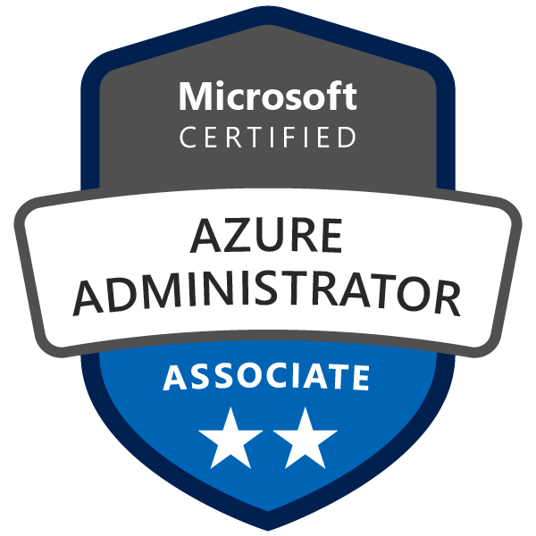

Hello! I’m Jeferson.

Experienced Systems Administrator working with Mainframe z/OS. 

Certificacao-AZ-104.png

 _Please visit my repository_ `Monitor_Abends` _I recently worked on a Python automation that triggers alerts for ABEND jobs in the IBM z/OS Mainframe._ 

