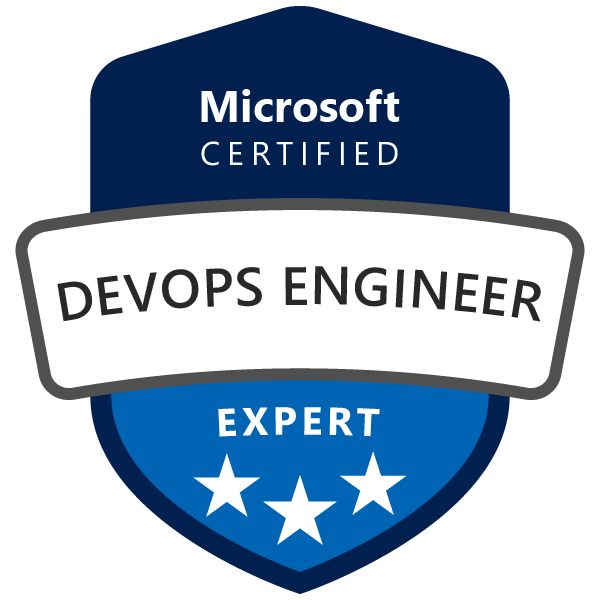

Systems Administrator for z/OS Mainframe.
Azure & DevOps enthusiast

  &ensp;&ensp;
  &ensp;&ensp;
  

 _Hey! Visit my repository_ <a href="https://github.com/Nochelli/Monitor_Abends">`Monitor_Abends`</a>  _I recently worked on a Python automation that triggers alerts for ABEND jobs in the IBM z/OS Mainframe._ 

